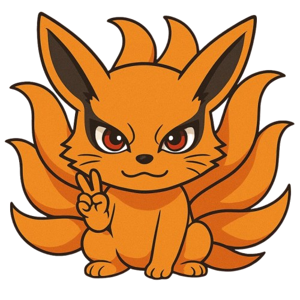
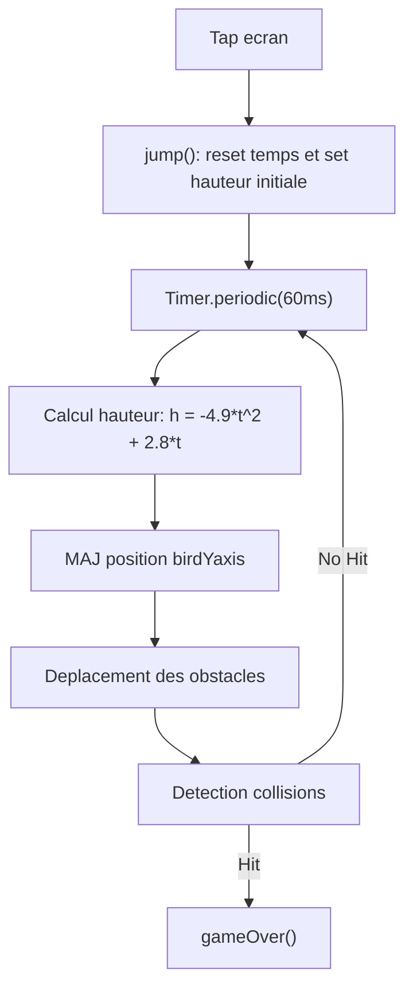

# 🥷 Flappy Ninja

> **Un mini-jeu Flutter inspiré du célèbre Flappy Bird**, où ton avatar (choisi parmi plusieurs ninjas légendaires 🌀) doit éviter les obstacles pour marquer le plus de points possible !

---

## 🎮 Aperçu du jeu


Flappy Ninja est une version revisitée du classique Flappy Bird, développée en ** Flutter/Dart **, avec :
- un menu d’accueil interactif et animé,
- un système de sélection d’avatars,
- un compteur de score et de meilleur score persistants,
- et une interface stylisée “arcade”.

Le jeu allie logique physique simple (saut, gravité, obstacles) à un design moderne.

---

## 🚀 Fonctionnalités principales

✅ **Saut et gravité**
- Le joueur contrôle un oiseau/ninja qui monte en tapotant l’écran (`jump()`).
- Une équation physique (`-4.9 * t² + 2.8 * t`) simule la trajectoire du saut.

✅ **Barrières dynamiques**
- Les obstacles se déplacent de droite à gauche à vitesse constante (`barrierXone` et `barrierXtwo`).
- Lorsqu’ils sortent de l’écran, ils reviennent de l’autre côté pour un cycle infini.

✅ **Détection de collisions**
- Si l’avatar touche le sol, le plafond ou une barrière, la partie s’arrête (`gameOver()`).

✅ **Score et meilleur score**
- Le score augmente à chaque obstacle franchi.
- Le meilleur score (`best`) est **enregistré localement** grâce à `shared_preferences`.

✅ **Menu d’accueil**
- L’écran principal permet de **choisir un avatar** avant de commencer la partie.
- Une animation du logo et un bouton stylisé "🚀 COMMENCER" offrent une expérience immersive.

✅ **Sauvegarde persistante**
- Les scores sont sauvegardés sur l’appareil et conservés même après fermeture.

---

## 🧠 Logique du jeu (simplifiée)



## 🧰 Outils et technologies utilisés

| 🧩 **Technologie** | ⚙️ **Utilisation** |
|--------------------|--------------------|
| 🐦 **Flutter 3.35+ / Dart** | Framework principal |
| 🎨 **Material Design** | Interface graphique et boutons |
| ⏱️ **Timer (`dart:async`)** | Animation du saut et des obstacles |
| 💾 **Shared Preferences** | Persistance du meilleur score |
| 🌀 **AnimatedContainer** | Animation fluide des éléments du jeu |
| 🧱 **Custom Widgets** | Séparation des composants (`MyBird`, `MyBarrier`, `MyWelcome`) |
| 🌈 **LinearGradient** | Effet visuel d’arrière-plan |
| 🧭 **Navigator** | Gestion des transitions entre écrans |

## 🧩 **Structure du projet**

```markdown
lib/
│
├── main.dart              # Point d’entrée du jeu
├── homepage.dart          # Logique principale (physique, obstacles, score)
├── welcome.dart           # Menu d’accueil et sélection d’avatar
├── bird.dart              # Widget de l’avatar (image dynamique)
├── barriers.dart          # Widget des obstacles
└── images/                # Dossier des assets (avatars et logo)
```
## ⚙️ **Installation et exécution**

### 1️⃣ **Cloner le projet**
```bash
git clone https://github.com/<ton-nom-utilisateur>/flappy_ninja.git
cd flappy_ninja
```

### 2️⃣ **Installer les dépendances**
```bash
flutter pub get
```
### 3️⃣ ***Lancer le jeu***
```bash
flutter run
```
###4️⃣ ***(Optionnel) Nettoyer le projet***
```bash
flutter clean && flutter pub get
```
## 📦 Dépendances principales
yaml
```bash
dependencies:
  flutter:
    sdk: flutter
  shared_preferences: ^2.3.0
```

## 🧑‍💻 Auteurs et contributeurs
```bash
👨‍💻 Développeur principal : Decaho Gbegbe
🎨 Design / UI : Collaborateurs du projet Flappy Ninja
📚 Université d’Ottawa — Projet personnel inspiré de Flappy Bird
```
## ⚖️ Droits et mentions légales
```bash
© 2025 Flappy Ninja — Tous droits réservés.

Ce projet est développé à des fins éducatives et personnelles.
Toute reproduction, distribution ou modification du code à des fins commerciales sans autorisation explicite est interdite.

Les images et noms d’avatars utilisés appartiennent à leurs détenteurs respectifs (licences libres ou fan-art).
L’auteur ne revendique aucun droit d’auteur sur les personnages inspirés de l’univers Naruto™.
```
### 🌟 À venir (Roadmap)
```bash
🎯 Fonctionnalité	🧩 Description
🎵 Sons et musiques d’ambiance	Intégration du package audioplayers
🌈 Thèmes jour/nuit	Changement automatique du thème
🔥 Tableau des scores global	Sauvegarde en ligne via Firebase
📱 Version mobile complète	Déploiement Android/iOS
💾 Sauvegarde cloud	Synchronisation du meilleur score sur le cloud
```
## 🕹️ Exemple de rendu

> “Un petit jeu amusant et codé avec passion 🧠💪 — Flutter power!”


## 🧡 Support
Tu aimes ce projet ?

## ⭐ Laisse une étoile sur GitHub pour soutenir le développement et encourager les futures mises à jour !
